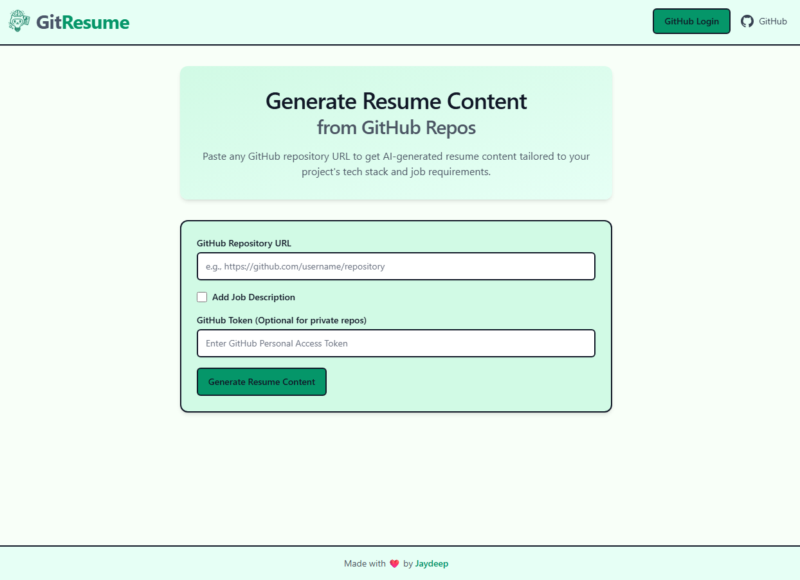

# GitResume 🚀

**Transform your GitHub repositories into professional, ATS-optimized resumes using AI.**


[](https://gitresume.live)
[](https://www.python.org/downloads/)
[](https://fastapi.tiangolo.com/)
[](https://www.docker.com/)
[](https://choosealicense.com/licenses/mit/)
[](https://github.com/whoisjayd/gitresume/issues)
[](https://github.com/whoisjayd/gitresume/stargazers)
[](https://github.com/whoisjayd/gitresume)

---

## Table of Contents

- [Live Demo](#live-demo)
- [Project Overview](#project-overview)
- [Key Features](#key-features)
- [Tech Stack](#tech-stack)
- [Getting Started](#getting-started)
- [Configuration](#configuration)
- [Resume Output](#resume-output)
- [FAQ](#frequently-asked-questions)
- [Security](#security--best-practices)
- [Contributing](#contributing)
- [License](#license)
- [Acknowledgments](#acknowledgments)
- [Architecture Overview](#architecture-overview)
- [API Endpoints](#api-endpoints)
- [Module Breakdown](#module-breakdown)
- [Why GitResume?](#why-gitresume)
- [Contact](#contact)

---

## 🌐 Live Demo

Experience GitResume in action: [https://gitresume.live](https://gitresume.live)

---

## 📝 Project Overview

GitResume is a production-ready FastAPI web application that leverages AI to convert your GitHub repositories into
polished, ATS-friendly resume content. By analyzing your codebase with advanced parsing techniques, it extracts
technical achievements and transforms them into impactful resume sections. Tailored for engineers at all career stages,
GitResume supports multiple AI providers, offers real-time processing, and is fully containerized for seamless
deployment.

---

## ✨ Key Features

- **Advanced Code Analysis:** Utilizes `tree-sitter` to deeply parse code, identifying structure, technologies, and
  complexity.
- **AI-Driven Resume Creation:** Integrates with leading AI models (Gemini, OpenAI, Groq, Claude) for high-quality
  content generation.
- **Real-Time Feedback:** WebSocket-based streaming delivers live progress updates for an engaging user experience.
- **Secure Authentication:** GitHub OAuth enables safe access to both public and private repositories.
- **Rate Limiting & Caching:** Supports Redis or in-memory options to ensure performance and prevent abuse.
- **Production-Grade Deployment:** Multi-stage Docker setup with non-root user, health checks, and optimized image size.
- **Flexible Configuration:** Manage secrets and settings via `.env` or `env.yaml` for both local and Docker
  environments.
- **Extensible Architecture:** Modular design allows easy integration of new AI providers, resume formats, or parsing
  tools.
- **ATS Optimization:** Generates structured JSON output tailored for Applicant Tracking Systems.
- **Customizable Output:** Supports job-specific tailoring by incorporating job descriptions into resume generation.

---

## 🛠️ Tech Stack

| Component            | Technology                                         |
|----------------------|----------------------------------------------------|
| **Backend**          | Python 3.11, FastAPI, Starlette, Pydantic, SlowAPI |
| **Frontend**         | Jinja2 Templates, Tailwind CSS (CDN)               |
| **AI Providers**     | Gemini, OpenAI, Groq, Claude                       |
| **Caching**          | Redis (optional)                                   |
| **Containerization** | Docker, Uvicorn                                    |
| **Code Parsing**     | Tree-sitter                                        |

---

## 🚀 Getting Started

### Prerequisites

- **Python 3.11** (for local development)
- **Docker** (recommended for production)
- **Git** (for cloning repositories)
- **Redis** (optional, for rate limiting and session management)
- **API Keys**:
    - GitHub OAuth (`GITHUB_CLIENT_ID`, `GITHUB_CLIENT_SECRET`, `GITHUB_TOKEN`)
    - AI Providers (Gemini, OpenAI, Groq, Claude)

### Installation (Local)

1. **Clone the Repository:**
   ```bash
   git clone https://github.com/whoisjayd/gitresume.git
   cd gitresume
   ```
2. **Set Up Virtual Environment:**
   ```bash
   python -m venv venv
   source venv/bin/activate  # On Windows: venv\Scripts\activate
   ```
3. **Install Dependencies:**
   ```bash
   pip install --upgrade pip
   pip install -r requirements.txt
   ```
4. **Configure Environment Variables:**
    - Copy `.env.example` to `.env` and populate with your API keys and secrets.
    - Alternatively, use `env.yaml` for configuration.
5. **Run the Application:**
   ```bash
   uvicorn app:app --host 0.0.0.0 --port 8080
   ```
   Access the app at [http://localhost:8080](http://localhost:8080).

### Docker Deployment

1. **Build the Docker Image:**
   ```bash
   docker build -t gitresume .
   ```
2. **Run the Container:**
   ```bash
   docker run --env-file .env -p 8080:8080 gitresume
   ```
   Alternatively, mount `env.yaml` for configuration:
   ```bash
   docker run -v $(pwd)/env.yaml:/app/env.yaml -p 8080:8080 gitresume
   ```

---

## 🔧 Configuration

- **Environment Variables:**
    - Copy `.env.example` to `.env` or create `env.yaml`.
    - Key variables include:
        - `GITHUB_CLIENT_ID`, `GITHUB_CLIENT_SECRET`, `GITHUB_TOKEN`
        - `REDIS_HOST`, `REDIS_PORT`, `REDIS_USERNAME`, `REDIS_PASSWORD`
        - `AI_PROVIDER` (options: `gemini`, `openai`, `groq`, `claude`)
        - API keys for AI providers
        - `SESSION_SECRET_KEY`, `CALLBACK_URL`, `ENVIRONMENT`
    - Both `.env` and `env.yaml` are supported for local and Docker setups.
- **Example `.env`:**
  ```bash
  GITHUB_CLIENT_ID=your_client_id
  GITHUB_CLIENT_SECRET=your_client_secret
  AI_PROVIDER=gemini
  GEMINI_API_KEY=your_gemini_key
  ENVIRONMENT=production
  ```

---

## 📄 Resume Output

GitResume generates structured JSON output optimized for ATS systems and easy integration into resume templates. The
schema includes:

- `project_title`: Project name (string)
- `tech_stack`: List of technologies used (array)
- `bullet_points`: 4-6 concise achievement statements (array)
- `additional_notes`: Unique technical setup, deployment strategies, or noteworthy engineering decisions (string)
- `future_plans`: Logical next features or enhancements (string)
- `potential_advancements`: Advanced architectural improvements or optimizations (string)
- `interview_questions`: Array of objects with `question`, `answer`, and `category`

**Example Output:**

```json
{
  "project_title": "E-Commerce Platform",
  "tech_stack": [
    "Python",
    "Redis"
  ],
  "bullet_points": [
    "Developed scalable backend using FastAPI and Redis for caching.",
    "Integrated secure payment gateway and OAuth authentication.",
    "Implemented CI/CD pipeline with Docker and GitHub Actions.",
    "Optimized database queries, reducing latency by 30%."
  ],
  "additional_notes": "Designed modular microservices architecture for rapid feature deployment.",
  "future_plans": "Add automated testing and expand API documentation.",
  "potential_advancements": "Utilize event-driven design with message queues for order processing.",
  "interview_questions": [
    {
      "question": "How did you ensure scalability in the backend?",
      "answer": "By leveraging FastAPI's async capabilities and Redis for caching.",
      "category": "Backend Architecture"
    }
  ]
}
```

See `tools/create_resume.py` for the complete schema and output standards.

---

## ❓ Frequently Asked Questions

- **Is my GitHub data stored?**  
  No, repositories are cloned temporarily and deleted after analysis.
- **Which AI models are supported?**  
  Gemini, OpenAI, Groq, and Claude are fully integrated.
- **Can I analyze private repositories?**  
  Yes, after authenticating via GitHub OAuth.
- **How do I deploy in production?**  
  Use the provided Docker setup with environment variables configured.
- **How do I report bugs or suggest features?**  
  Open an issue on [GitHub Issues](https://github.com/whoisjayd/gitresume/issues).
- **How do I contribute?**  
  See the [Contributing](#contributing) section below for guidelines and steps.
- **How do I run tests?**  
  After installing dependencies, run `pytest` from the project root.

---

## 🤝 Contributing

We welcome contributions! Follow these steps:

1. Fork and clone the repository.
2. Create a feature branch: `git checkout -b feature/your-feature`.
3. Implement and test your changes locally.
4. Push to your fork and submit a pull request.

**Contribution Guidelines:**

- Follow PEP 8 for Python code.
- Include tests for new features (use `pytest`).
- Update documentation as needed.
- Be respectful and inclusive in all interactions (see [Code of Conduct](CODE_OF_CONDUCT.md)).

Report bugs or suggest features via [GitHub Issues](https://github.com/whoisjayd/gitresume/issues).

---

## 📜 License

This project is licensed under the [MIT License](LICENSE).

---

## 🙌 Acknowledgments

- **Core Technologies:
  ** [Python](https://www.python.org/), [FastAPI](https://fastapi.tiangolo.com/), [Tree-sitter](https://tree-sitter.github.io/), [Jinja2](https://jinja.palletsprojects.com/), [Tailwind CSS](https://tailwindcss.com/), [Redis](https://redis.io/), [Uvicorn](https://www.uvicorn.org/), [Docker](https://www.docker.com/)
- **AI Providers:
  ** [Google Gemini](https://cloud.google.com/generative-ai), [OpenAI](https://openai.com/), [Groq](https://groq.com/), [Anthropic Claude](https://www.anthropic.com/)

---

## 🏗️ Architecture Overview

GitResume follows a modular, scalable architecture:

- **Frontend:** Jinja2 templates styled with Tailwind CSS, served by FastAPI.
- **Backend:** FastAPI handles routing, API endpoints, and WebSocket connections.
- **Authentication:** GitHub OAuth for secure access to public and private repos.
- **Code Analysis:** Tree-sitter parses codebases for structure and technology insights.
- **AI Integration:** Modular support for Gemini, OpenAI, Groq, and Claude.
- **Caching & Rate Limiting:** Redis (optional) for session management and performance.
- **Deployment:** Docker with multi-stage builds for minimal, secure images.

### Workflow

1. User authenticates via GitHub OAuth and submits a repository URL.
2. The app clones the repo, validates it, and parses it using `tree-sitter`.
3. AI processes the analysis, generating resume content streamed via WebSocket.
4. User receives structured JSON output for download or integration.

---

## 🔗 API Endpoints

| Endpoint         | Method   | Description                     |
|------------------|----------|---------------------------------|
| `/`              | GET      | Home page                       |
| `/`              | POST     | Generate resume from repo URL   |
| `/login`         | GET      | Initiate GitHub OAuth           |
| `/callback`      | GET      | Handle OAuth callback           |
| `/logout`        | GET      | Log out                         |
| `/health`        | GET      | Health check endpoint           |
| `/{user}/{repo}` | GET/POST | Dynamic repo analysis           |
| `/ws/`           | WS       | WebSocket for real-time updates |

---

## 📦 Module Breakdown

| Module                    | Purpose                                      |
|---------------------------|----------------------------------------------|
| `app.py`                  | Core FastAPI app with routing and middleware |
| `tools/create_resume.py`  | Orchestrates AI resume generation            |
| `tools/git_operations.py` | Manages repo cloning and validation          |
| `tools/gitingest.py`      | Parses and summarizes codebases              |
| `tools/grammar_check.py`  | Ensures high-quality AI text output          |
| `tools/api_utils.py`      | Integrates with AI provider APIs             |
| `tools/utils.py`          | General utility functions                    |

---

## 🌟 Why GitResume?

- **Save Time:** Automate resume creation with AI-driven insights.
- **Stand Out:** Highlight technical achievements with ATS-friendly content.
- **Stay Flexible:** Support for multiple AI models and deployment options.
- **Open Source:** Built for the community, contributions welcome!

---

## 📬 Contact

Created with ❤️ by [Jaydeep Solanki](https://github.com/whoisjayd).  
Have questions or feedback? Reach out via [GitHub Issues](https://github.com/whoisjayd/gitresume/issues).